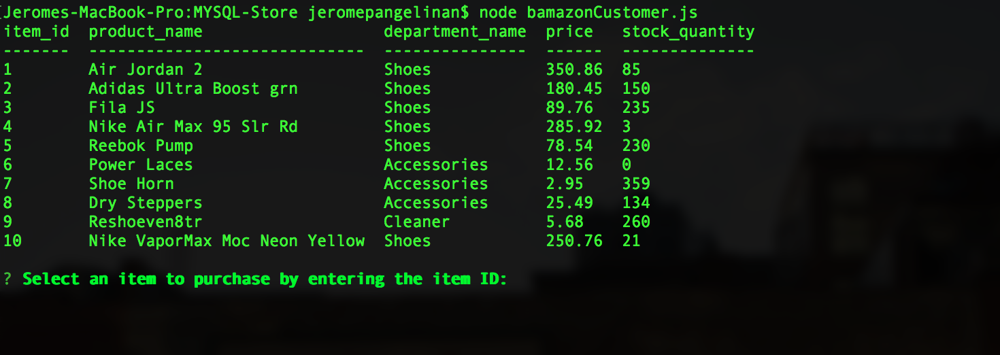
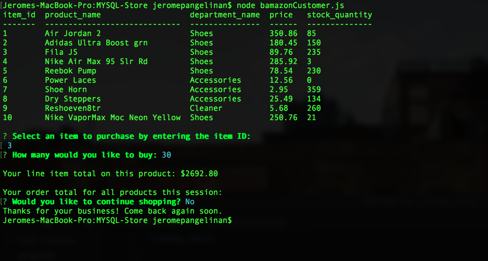
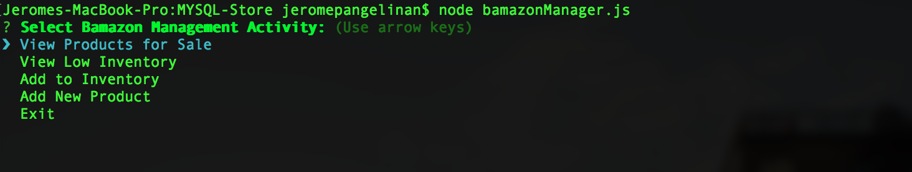
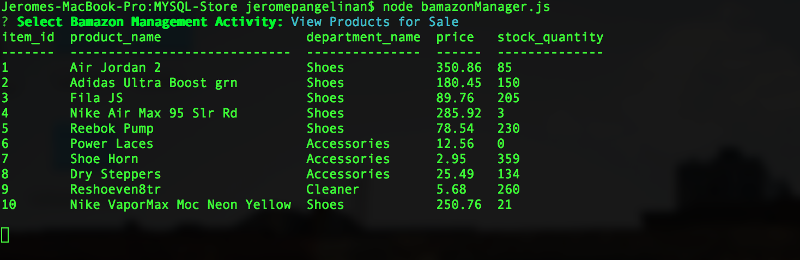
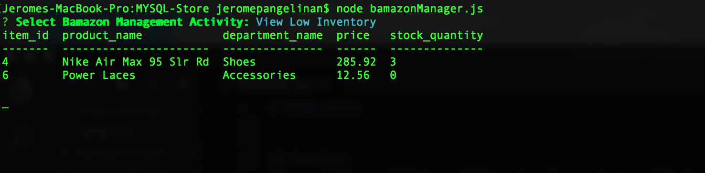
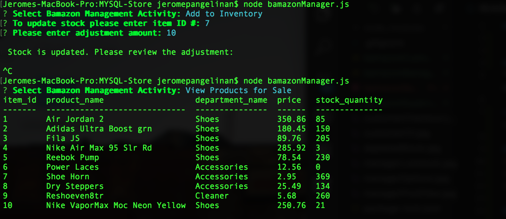
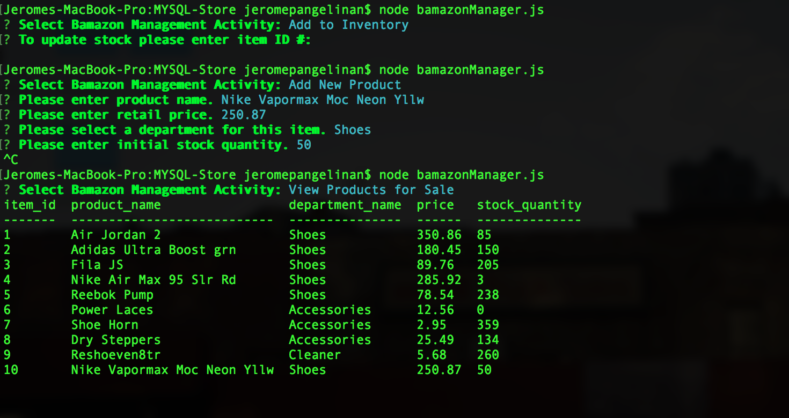

# MYSQL-Store

## OverView
"Bamazon" Store utilizing a CLI to shop for products and Employers to check inventory, add stock and add new products. MySQL database to organize and track products and Node.js to create a path to the database and support functionality of the options given
in CLI.

## Customer CLI Shopping Options
* In the Command Line Interface, a shopper will have the option to buy a product. The images below demonstrates the protocol in choosing an item, the quantity and whether to keep shopping or checkout.

Customer Interface with options to shop for product

nformation of steps taken to purchase item

When table is refreshed, shows item depletion

## Manager CLI Options
* In node manager.js one is able to view the current inventory, view what is low in stock, add stock and add a new product. 

Manager Options

View of inventory

View of what is low in stock

Steps towards adding inventory stock

Added stock in table

Steps towards adding new product which is displayed in table

